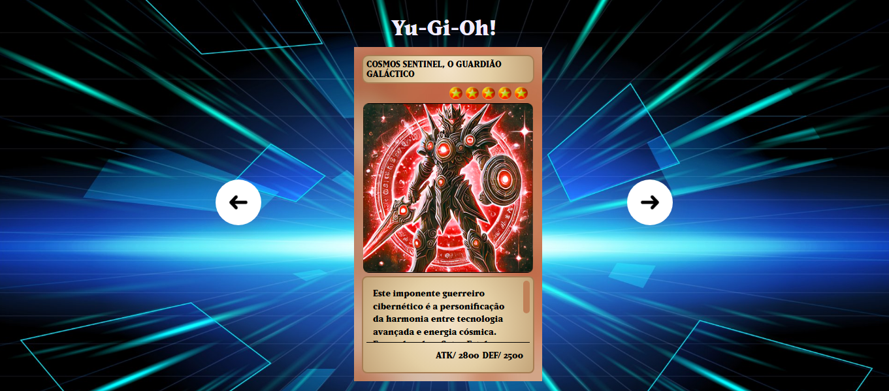

<h2 id="sobre-o-projeto">1. 🃏 Yu-Gi-Oh! - Deck Interativo 🃏</h2>


[](https://github.com/Domisnnet/Yu-Gi-Web-Essentials/blob/main/LICENSE)



Bem-vindo ao **Yu-Gi-Oh! Deck Interativo**! Este projeto é uma recriação estilizada da interface de exibição de cartas do popular TCG, focada em proporcionar uma experiência imersiva para visualizar atributos, níveis e descrições das cartas clássicas com um toque de design moderno e responsivo.

---

## 📚 Tabela de Conteúdo

| 🃏 O Projeto | 🛠️ Técnico | 🤝 Comunidade |
| :---: | :---: | :---: |
| [](#sobre-o-projeto) | [](#destaques-tecnicos) | [](#codigo-fonte) |
| [](#tecnologias-utilizadas) | [](#instalacao) | [](#créditos) |
| [](#como-acessar) | [](#como-contribuir) | [](#licenca) |
| [](#funcionalidades) | [](#faq) | [](#perfil-do-github) |

---

<h2 id="tecnologias-utilizadas">2. ⚙️ Tecnologias Utilizadas</h2>

| Camada | Tecnologias | Descrição |
| :--- | :--- | :--- |
| **Frontend** |   | Estrutura semântica e estilização inspirada no design do jogo. |
| **Lógica** |  | Gerenciamento de estado do slider e interatividade de seleção. |
| **Assets** |  | Tipografia personalizada para fidelidade visual ao universo Yu-Gi-Oh!. |

---

<h2 id="como-acessar">3. 🚀 Como Acessar</h2>

Clique no botão abaixo para iniciar o seu duelo e navegar pelo deck diretamente no seu navegador:

<div align="left">
  <a href="https://domisnnet.github.io/Yu-Gi-Web-Essentials/" target="_blank">
    
  </a>
</div>

---

<h2 id="funcionalidades">4. 🧩 Funcionalidades Principais</h2>

O projeto replica a mecânica de visualização de cartas com fluidez:

| Funcionalidade | Descrição |
| :--- | :--- |
| 🔄 **Slider de Cartas** | Navegação lateral intuitiva através de botões de seta customizados. |
| ⭐ **Nível Visual** | Renderização dinâmica do nível da carta através de ícones de estrelas. |
| 🛡️ **Atributos ATK/DEF** | Exibição clara das estatísticas de batalha de cada monstro. |
| 📱 **Layout Responsivo** | Adaptação completa da "arena" de visualização para Mobile e Tablets. |
| 🎨 **Efeito de Seleção** | Destaque visual e troca de classes CSS para a carta ativa no slider. |

---

<h2 id="destaques-tecnicos">5. 💻 Destaques Técnicos</h2>

A construção deste deck focou na manipulação precisa do DOM e organização de estilos:

### 📐 Gerenciamento de Classes
Uso de JavaScript para alternar a classe `.selecionado` dinamicamente, permitindo que as transições de opacidade e escala no CSS criem o efeito de foco na carta central.

### 🔄 Reset e Flexibilidade
Utilização de um arquivo `reset.css` para garantir consistência entre navegadores e `responsivo.css` para reestruturar o slider em telas menores, mantendo a integridade das proporções das cartas.

---

<h2 id="instalacao">6. 🚀 Instalação e Configuração Local</h2>

Deseja analisar a estrutura do deck ou clonar para seus próprios duelos? Explore o repositório oficial:

```bash
# Clonar o repositório
git clone https://github.com/Domisnnet/Yu-Gi-Web-Essentials.git(https://github.com/Domisnnet/Yu-Gi-Web-Essentials.git)

# Acessar a pasta
cd Yu-Gi-Web-Essentials
```

---

<h2 id="como-contribuir">7. 🤝 Como Contribuir</h2>

Siga os passos abaixo para fortalecer este projeto:

| Fase | Ação | Link / Comando |
| :---: | :--- | :--- |
| **01** | **Fork** | [](https://github.com/Domisnnet/Yu-Gi-Web-Essentials/fork) |
| **02** | **Branch** | `git checkout -b feature/NovaCarta` |
| **03** | **Commit** | `git commit -m 'feat: adição do Mago Negro ao deck'` |
| **04** | **Push** | `git push origin feature/NovaCarta` |
| **05** | **PR** | [](https://github.com/Domisnnet/Yu-Gi-Web-Essentials/compare)

### 🐛 Encontrou um problema?
Se algo não estiver funcionando como esperado, não hesite em abrir um chamado:

[](https://github.com/Domisnnet/Yu-Gi-Web-Essentials/issues)
[](https://github.com/Domisnnet/Yu-Gi-Web-Essentials/issues/new)

---

<h2 id="faq">8. 🧠 Perguntas Frequentes do Duelista</h2>

<details>
<summary><strong>Como as estrelas de nível são geradas ❓</strong></summary>
<p>⭐ <strong>Resposta:</strong> Cada carta possui uma <code>div.nivel-carta</code> que contém uma lista de imagens de estrelas. A quantidade é definida estaticamente no HTML para cada carta, seguindo a regra oficial do jogo.</p>
</details>

<details>
<summary><strong>O slider é infinito ❓</strong></summary>
<p>🔄 <strong>Resposta:</strong> Atualmente a navegação para quando o usuário chega na primeira ou última carta. Uma funcionalidade futura prevista é o loop infinito para facilitar a navegação rápida.</p>
</details>

<details>
<summary><strong>Posso usar as classes de fundo para outras cartas ❓</strong></summary>
<p>🎨 <strong>Resposta:</strong> Com certeza. O CSS foi modularizado com classes como <code>fundo-1</code>, <code>fundo-2</code>, etc., permitindo reaproveitar as cores e gradientes em novos elementos.</p>
</details>

---

<h2 id="codigo-fonte">9. 💻 Código Fonte</h2>

Explore a estrutura de lógica e design diretamente:


[](https://github.com/Domisnnet/Yu-Gi-Web-Essentials)

---

<h2 id="créditos">10. 📝 Créditos & Reconhecimentos</h2>

O projeto Yu-Gi-Oh! é uma homenagem ao icônico universo criado por Kazuki Takahashi:

| Atribuição | Responsável / Recurso | Descrição |
| :--- | :--- | :--- |
| **Dev & Design** | **DomisDev** | Implementação da lógica do slider e estilização responsiva. |
| **Criação Original** | **Konami / Kazuki Takahashi** | Inspiração de marca, artes das cartas e mecânicas visuais. |
| **Documentação** | **MDN Web Docs** | Guia técnico para as linguagens fundamentais (HTML/CSS/JS). |
| **Apoio Técnico** | **Google Gemini** | Suporte na organização de documentação e padronização. |

### 🎯 Missão do Projeto
> "Este projeto visa demonstrar como a manipulação de listas e classes CSS pode criar interfaces temáticas ricas, servindo de estudo para desenvolvedores que buscam unir lógica de programação a identidades visuais marcantes."

---

<h2 id="licenca">11. 📄 Licença</h2>

Este projeto está licenciado sob a [](https://github.com/Domisnnet/Yu-Gi-Web-Essentials/blob/main/LICENSE)

---

<h2 id="perfil-do-github">12. 👨‍💻 Perfil do GitHub</h2>

<a href="https://github.com/Domisnnet"> 
   
</a>
